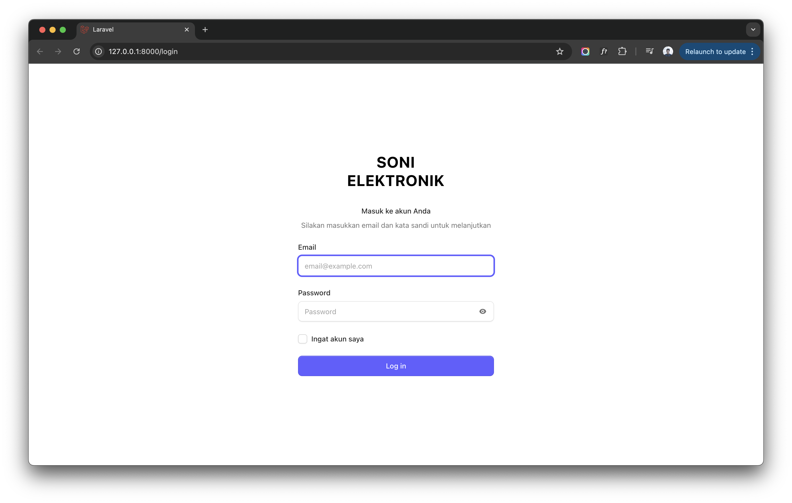
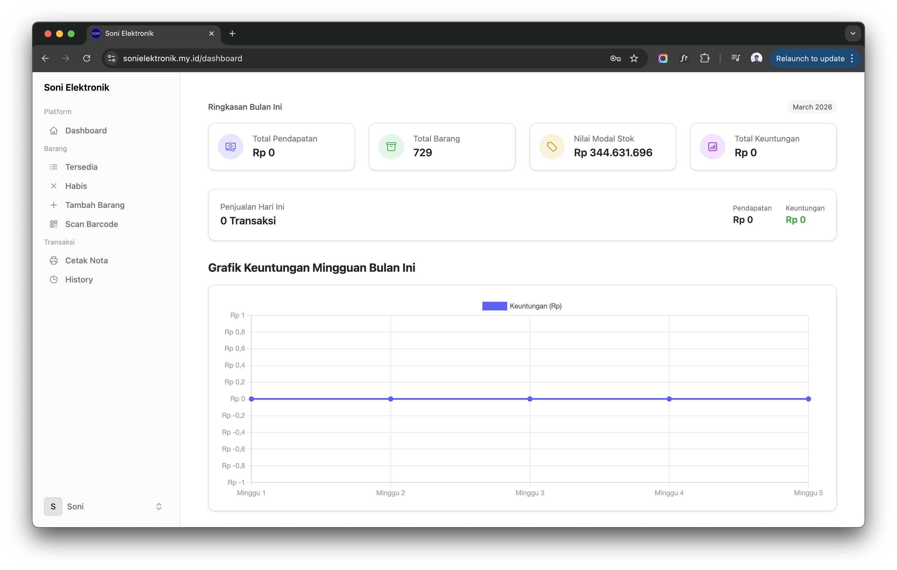
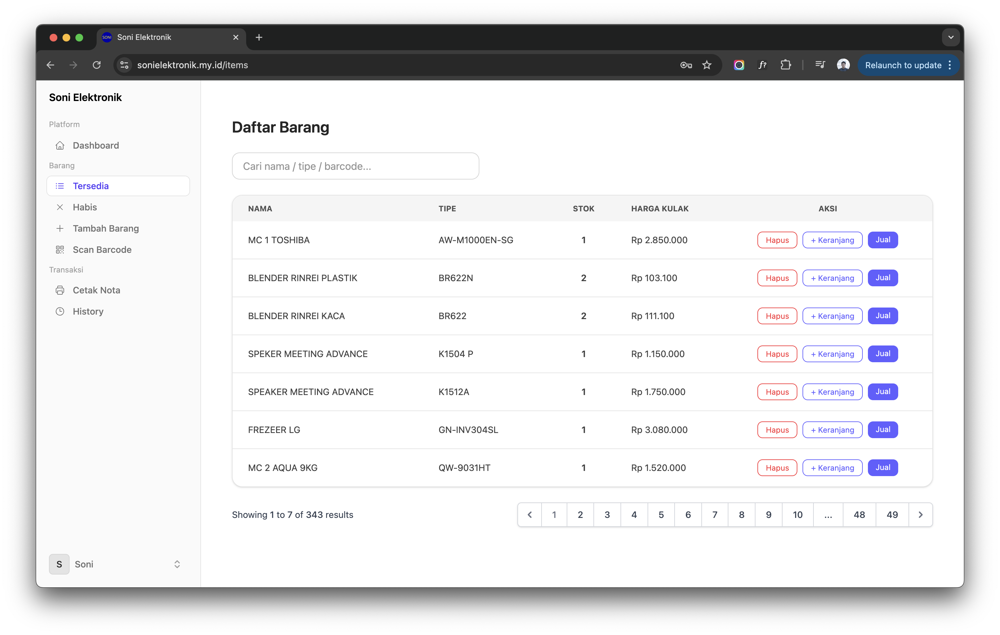
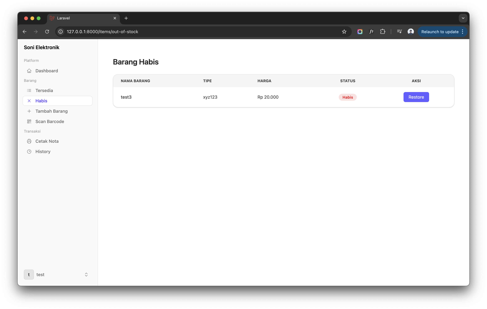
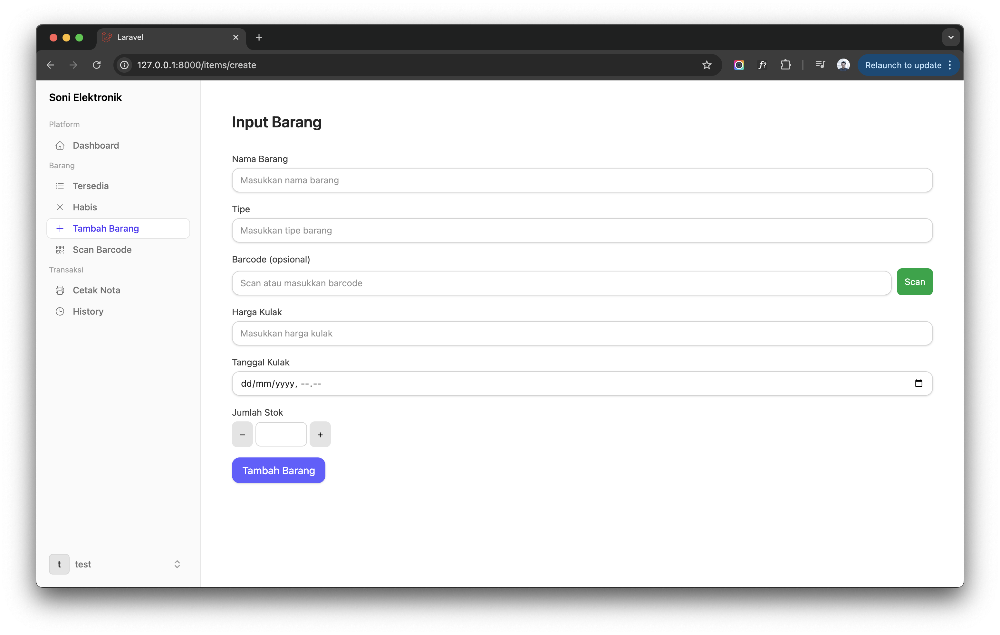
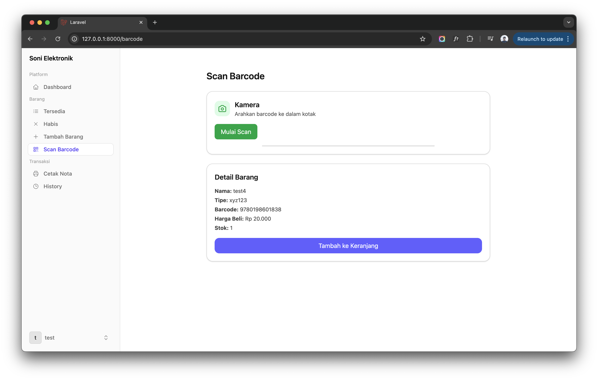
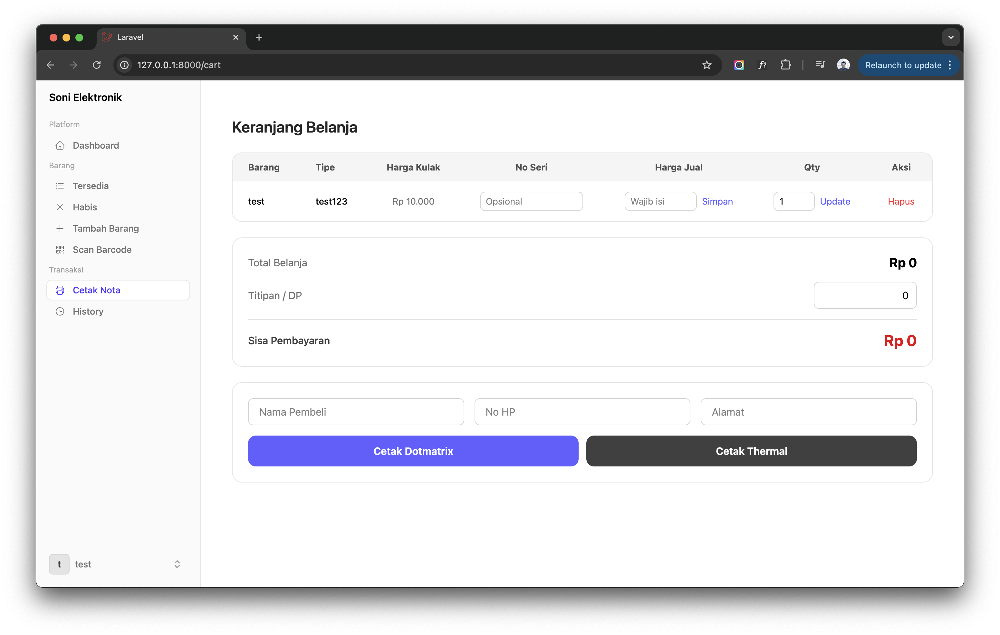

<p align="center">
  
</p>

# POS Soni Elektronik

A real-world Point of Sale (POS) and Inventory Management System built using Laravel and Livewire.  
This project was developed for a small retail electronics store and is currently used in real daily operations.

## 📌 Background

This system was created to solve real problems in a family-owned retail store that sells home appliances and electronics in a small-town environment.  
The goal was to build a simple, fast, and reliable POS system tailored to actual user needs instead of using complex commercial software.

## 🚀 Features

- Product management
- Stock management
- Purchase price & selling price validation
- Barcode support (optional & unique)
- Transaction / cashier system
- Thermal / dotmatrix printer support
- Multi-user login
- Server-side validation (Livewire)
- Dark mode UI
- Responsive layout

## 🧩 Tech Stack

- Laravel 10+
- Livewire 3
- MySQL
- TailwindCSS
- Alpine.js

## 🏪 Real Use Case

This system is actively used in a real retail store:

- Small electronics shop
- Used by non-technical users
- Runs on local network
- Connected to receipt printer
- Handles real transactions daily

Because this is a real production project, some configuration files are excluded for security reasons.

## 📷 Screenshots

### Login Page



### Dashboard



### Item List



### Out of Stock List



### Input Item



### Search Item By Scan Barcode Feature



### Cart Page



## ⚙️ Setup

```bash
git clone https://github.com/jaizyikhwan/pos-soni-elektronik.git
cd pos-soni-elektronik
cp .env.example .env
composer install
php artisan key:generate
php artisan migrate
php artisan serve
```
